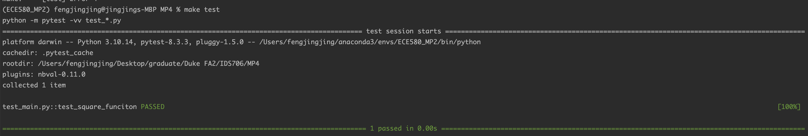

# jf361_ids706_mp4

[](https://github.com/siyiia/jf361_ids706_mp4/actions/workflows/cicd.yml)

 ## Project Introduction
This project demonstrates the use of GitHub Actions Matrix Build to test a Python script across multiple Python versions.


## Project Requirments
- Set up a Gitlab Actions workflow
- Test across at least 3 different Python versions

## Project Setup
1. Implement a simple python function in `main.py` and test its functionality in `test_main.py`
2. Add required packages in `requirements.txt` and create a `Makefile` to automate build the project.
3. In `.github/workflows/*.yml` file, add below codes to allow GitHub test a a Python script across multiple Python versions
   ```angular2html
    strategy:
      matrix:
        python-version: [ 3.7, 3.8, 3.9, 3.11 ]
        os: [ ubuntu-latest, windows-latest ]
    runs-on: ${{ matrix.os }}

    steps:
      - name: Set up Python
        uses: actions/setup-python@v4
        with:
          python-version: ${{ matrix.python-version }}
   ```

## Project Demonstration
Format code
<p align="center">
  
</p>
lint code
<p align="center">
  
</p>
test code
<p align="center">
  
</p>

GitHub Actions Matrix
<p>
  
</p>